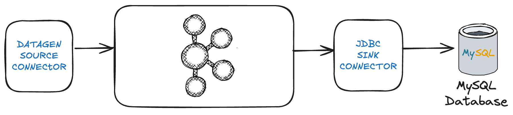
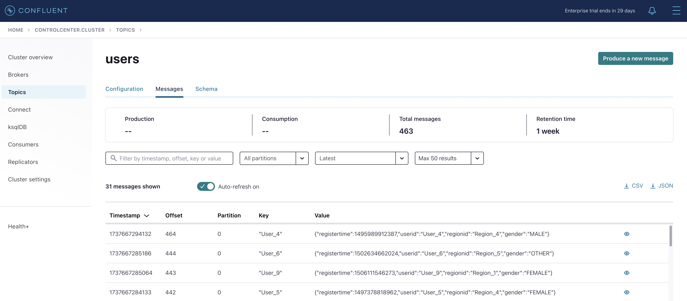
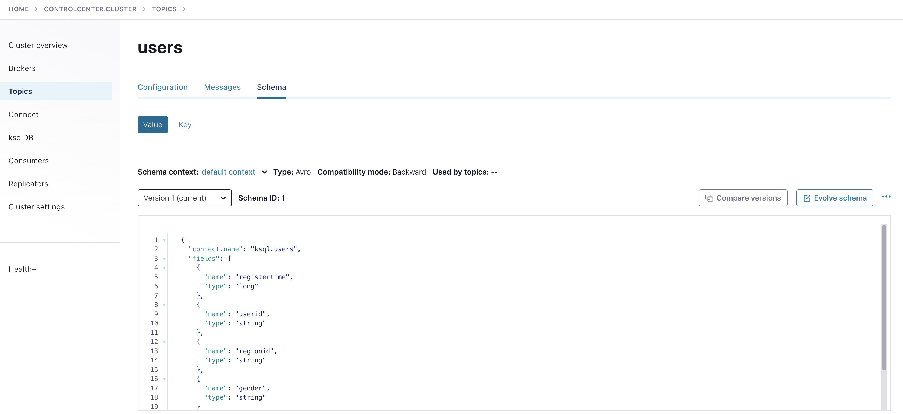

# Kafka Connect

En esta sección practicaremos con la administración de conectores **source** y **sink**.

El pipeline de datos streaming que crearemos es el siguiente:



## Get Kakfa Connect Status

Como primer paso vamos a comprobar el estado nuestro cluster de `Kafka Connect` para ello usaremos el [API de administración](https://docs.confluent.io/platform/current/connect/references/restapi.html).

Podemos acceder a esta `API` desde nuestra máquina.

Nota: En caso de que vuestra distribución de docker no permita la comunicación con el contenedor podréis ejecutar los mismos comandos desde el mismo contenedor. Para entrar en él ejecutaremos:

```shell
docker exec -it connect /bin/bash
```

Una vez dentro comprobaremos el estado y versiones instaladas llamando:

```shell
curl http://localhost:8083 | jq
```

obtendremos una salida como esta:

```json
{
  "version": "7.8.0-ccs",
  "commit": "cc7168da1fddfcfde48b42031adde57bb5bcf529",
  "kafka_cluster_id": "Nk018hRAQFytWskYqtQduw"
}
```

En la respuesta podemos vemos la versión y commit del servidor y el id kafka cluster que hace de backend de el. 

Si obtenemos esta clase de respuesta es que nuestro cluster de connect esta preparado para trabajar.

## Get Connector Plugins

Para obtener los plugins instalados:

```shell
curl http://localhost:8083/connector-plugins | jq
```

Deberíamos obtener una salida parecida a esta:

```json
[
  {
    "class": "org.apache.kafka.connect.mirror.MirrorCheckpointConnector",
    "type": "source",
    "version": "7.8.0-ccs"
  },
  {
    "class": "org.apache.kafka.connect.mirror.MirrorHeartbeatConnector",
    "type": "source",
    "version": "7.8.0-ccs"
  },
  {
    "class": "org.apache.kafka.connect.mirror.MirrorSourceConnector",
    "type": "source",
    "version": "7.8.0-ccs"
  }
]
```

como vemos los únicos plugins instalados son los correspondientes a `MirrorMaker`

## Get Connectors 

Para obtener las instancias de los conectores:

```bash
curl http://localhost:8083/connectors | jq
```

```json
[]
```

obtenemos una salida vacía (ya que no tenemos todavía ningún conector corriendo)

> Nota: Todos los comandos que vayamos ejecutando los podréis ejecutar como sh desde la carpeta 5.connect
> Os recomiendo usar un entorno linux (Linux, MAC o WSL en el caso de usar windows)

## Install Connector Plugins

### Install Datagen Source Connector Plugin

Como primer paso vamos a instalar un plugin de conector tipo **source**, es decir uno que inserte datos en un topic Kafka. 

El connector que usaremos es `Datagen Source Connector`, un conector que nos permitirá generar dato sintético en un topic Kafka.

[Documentación](https://github.com/confluentinc/kafka-connect-datagen/blob/master/README.md)

Para instalar el `plugin` correspondiente al conector dentro de nuestro contenedor connect. 
Usaremos el comando  `confluent-hub` ya instalado en nuestro contenedor.

```shell
docker exec -it connect /bin/bash
```
El siguiente comando lo ejecutamos dentro del contenedor:

```shell
confluent-hub install confluentinc/kafka-connect-datagen:0.6.6
```

```sh
[appuser@connect ~]$ confluent-hub install confluentinc/kafka-connect-datagen:0.6.6
The component can be installed in any of the following Confluent Platform installations: 
  1. / (installed rpm/deb package) 
  2. / (where this tool is installed) 
Choose one of these to continue the installation (1-2): 1
Do you want to install this into /usr/share/confluent-hub-components? (yN) y

 
Component's license: 
Apache License 2.0 
https://www.apache.org/licenses/LICENSE-2.0 
I agree to the software license agreement (yN) y

Downloading component Kafka Connect Datagen 0.6.6, provided by Confluent, Inc. from Confluent Hub and installing into /usr/share/confluent-hub-components 
Detected Worker's configs: 
  1. Standard: /etc/kafka/connect-distributed.properties 
  2. Standard: /etc/kafka/connect-standalone.properties 
  3. Standard: /etc/schema-registry/connect-avro-distributed.properties 
  4. Standard: /etc/schema-registry/connect-avro-standalone.properties 
  5. Used by Connect process with PID : /etc/kafka-connect/kafka-connect.properties 
Do you want to update all detected configs? (yN) y

Adding installation directory to plugin path in the following files: 
  /etc/kafka/connect-distributed.properties 
  /etc/kafka/connect-standalone.properties 
  /etc/schema-registry/connect-avro-distributed.properties 
  /etc/schema-registry/connect-avro-standalone.properties 
  /etc/kafka-connect/kafka-connect.properties 
 
Completed 
```

### Install JDBC Connector Plugin

Ahora vamos a instalar un plugin de conector tipo **sink**, es decir uno que escribe datos a sistemas desde topics de Kafka.

El connector que usaremos es `JDBC Sink Connector`, un conector que nos permitirá escribir datos en base de datos a través del protocolo JDBC (**J**ava **D**ata **B**ase **C**onnectivity)

[Documentación](https://docs.confluent.io/kafka-connectors/jdbc/current/sink-connector/overview.html)

Procedemos igual que antes:

```bash
confluent-hub install confluentinc/kafka-connect-jdbc:10.8.0
```

```bash
[appuser@connect ~]$ confluent-hub install confluentinc/kafka-connect-jdbc:10.8.0
The component can be installed in any of the following Confluent Platform installations:
  1. / (installed rpm/deb package)
  2. / (where this tool is installed)
Choose one of these to continue the installation (1-2): 1
Do you want to install this into /usr/share/confluent-hub-components? (yN) y


Component's license:
Confluent Community License
https://www.confluent.io/confluent-community-license
I agree to the software license agreement (yN) y

Downloading component Kafka Connect JDBC 10.8.0, provided by Confluent, Inc. from Confluent Hub and installing into /usr/share/confluent-hub-components
Detected Worker's configs:
  1. Standard: /etc/kafka/connect-distributed.properties
  2. Standard: /etc/kafka/connect-standalone.properties
  3. Standard: /etc/schema-registry/connect-avro-distributed.properties
  4. Standard: /etc/schema-registry/connect-avro-standalone.properties
  5. Used by Connect process with PID : /etc/kafka-connect/kafka-connect.properties
Do you want to update all detected configs? (yN) y

Adding installation directory to plugin path in the following files:
  /etc/kafka/connect-distributed.properties
  /etc/kafka/connect-standalone.properties
  /etc/schema-registry/connect-avro-distributed.properties
  /etc/schema-registry/connect-avro-standalone.properties
  /etc/kafka-connect/kafka-connect.properties

Completed
```

El conector JDBC necesita los drivers Java específicos de cada BD, en nuestro caso los de MySQL. 
En la carpeta `1.environment/mysql` podéis encontrar el jar del driver en cuestión.
Para copiarlo a nuestro contendor (ejecutar este comando en el directorio 5.connect):

```bash
docker cp ../1.environment/mysql/mysql-connector-java-5.1.45.jar connect:/usr/share/confluent-hub-components/confluentinc-kafka-connect-jdbc/lib/mysql-connector-java-5.1.45.jar
```

> ❗️ **NOTA**<br/>Si tuviéramos que conectarnos a otro tipo de base de datos como Oracle, Postgres, DB2 ... bastaría con hacer lo mismo con el correspondiente driver

## Get Connector Plugins

Comprobemos si ya aparecen instalados ambos conectores:

```bash
curl http://localhost:8083/connector-plugins | jq
```

Los conectores instalados siguen sin aparecer. 

Esto es porque el servicio Kafka Connect ya está levantado. Necesitamos reiniciar el contenedor para que pueda detectar los nuevos conectores instalados. 

Lo haremos ejecutando:

```bash
docker compose restart connect
```

una vez reiniciado comprobamos de nuevo la lista de plugins:

```bash
curl http://localhost:8083/connector-plugins | jq
```

observando que ahora si los tenemos disponible:

```json
[
  {
    "class": "io.confluent.connect.jdbc.JdbcSinkConnector",
    "type": "sink",
    "version": "10.8.0"
  },
  {
    "class": "io.confluent.connect.jdbc.JdbcSourceConnector",
    "type": "source",
    "version": "10.8.0"
  },
  {
    "class": "io.confluent.kafka.connect.datagen.DatagenConnector",
    "type": "source",
    "version": "null"
  },
  {
    "class": "org.apache.kafka.connect.mirror.MirrorCheckpointConnector",
    "type": "source",
    "version": "7.8.0-ccs"
  },
  {
    "class": "org.apache.kafka.connect.mirror.MirrorHeartbeatConnector",
    "type": "source",
    "version": "7.8.0-ccs"
  },
  {
    "class": "org.apache.kafka.connect.mirror.MirrorSourceConnector",
    "type": "source",
    "version": "7.8.0-ccs"
  }
]

```

> ❗️ **NOTA**<br/>El connector JDBC instala dos conectores: el tipo Source como el Sink

## Create Datagen Source Connector Instance

Lo siguiente será crear una nueva instancia de nuestro conector  

Para ello primero deberemos crear una configuración válida para él.

[Documentación](https://github.com/confluentinc/kafka-connect-datagen/tree/master) 

Tras revisar la documentación:

```json
{
  "name": "source-datagen-users",
  "config": {
    "connector.class": "io.confluent.kafka.connect.datagen.DatagenConnector",
    "kafka.topic": "users",
    "quickstart": "users",
    "max.interval": 1000,
    "iterations": 10000000,
    "tasks.max": "1"
  }
}
```

Además de configuración específica del conector, como que usamos el quickstart con el modelo `users` o las iteraciones y el intervalo de publicación de mensaje, vemos alguna configuración genérica interesante:

1. `connector.class`: Clase que implementa el connector.
2. `kafka.topic`: Topic en el que publicará los mensajes (ojo esto es una configuración común pero no todos los conectores la llaman igual)
3. `key.converter`: Converter que usaremos para la serialización de la key (en este caso string)
4. `task.max`: Número máximo de tareas que se distribuirán en el cluster de connect.

para publicar esta configuración volveremos a usar el api de connect:

```bash
curl -d @"./connectors/source-datagen-users.json" -H "Content-Type: application/json" -X POST http://localhost:8083/connectors | jq
```

Con este curl estamos pasando un fichero que contiene la configuración para del connector, el verbo POST de HTTP nos indica que estamos en "modo creación"

> Nota:
> 
> Este comando debe ejecutarse desde la carpeta 5.connect
>
> En caso de estar ejecutando los curl desde el contenedor debeis copiar primero el fichero de configuración json a la carpeta desde donde ejecutéis el curl:
> 
> docker cp ./connectors/source-datagen-users.json connect:/home/appuser
> 
> Este comando lo podemos usar para subir schemas avro para usar con el Datagen Source Connector

Si ejecutamos ahora la consulta de conectores corriendo:

```
curl http://localhost:8083/connectors | jq
```

```json
[
  "source-datagen-users"
]
```

Ahora mismo ya podemos ver mensajes llegando a nuestro topic `users`, la manera más fácil de hacerlo es a través de `Control Center`:

[Control Center](http://localhost:9021/clusters/Nk018hRAQFytWskYqtQduw/management/topics)



Otro dato importante de este conector es que por defecto está haciendo uso de un schema (que ha registrado por nosotros), esto nos será especialmente util para el siguiente ejercicio. Podemos ver este esquema en la pestaña schema del topic:



Haciendo uso, de nuevo del api de connect podemos recibir la información importante del conector, parar, reiniciar, borrar, comprobar status de nuestro conector, etc:

Consulta Connector información:

```bash
curl http://localhost:8083/connectors/source-datagen-users
```

```json
{
  "name": "source-datagen-users",
  "config": {
    "connector.class": "io.confluent.kafka.connect.datagen.DatagenConnector",
    "quickstart": "users",
    "tasks.max": "1",
    "name": "source-datagen-users",
    "kafka.topic": "users",
    "max.interval": "1000",
    "iterations": "10000000"
  },
  "tasks": [
    {
      "connector": "source-datagen-users",
      "task": 0
    }
  ],
  "type": "source"
}
```

## Connector Status

Para comprobar el estado de un conector:

```bash
curl http://localhost:8083/connectors/source-datagen-users/status | jq

```

```json
{
  "name": "source-datagen-users",
  "connector": {
    "state": "RUNNING",
    "worker_id": "connect:8083"
  },
  "tasks": [
    {
      "id": 0,
      "state": "RUNNING",
      "worker_id": "connect:8083"
    }
  ],
  "type": "source"
}

```

Este `endpoint` es uno de los más importantes ya que no solo no dará información de las tareas y los nodos en que corren estas sino que en caso de que alguna estuviera en estado de fallo podríamos ver los logs asociados al mismo.

Ejemplo:

```json
{
    "name": "sink-hdfs-connector",
    "connector": {
        "state": "RUNNING",
        "worker_id": "example:8083"
    },
    "tasks":
    [
        {
            "id": 0,
            "state": "RUNNING",
            "worker_id": "example:8083"
        },
        {
            "id": 1,
            "state": "FAILED",
            "worker_id": "example:8083",
            "trace": "org.apache.kafka.common.errors.RecordTooLargeException\n"
        }
    ]
}
```

## Connector Stop

Para detener un conector de forma controlada:

```bash
curl -X PUT http://localhost:8083/connectors/source-datagen-users/stop | jq
```

Volvemos a comprobar su status:

```bash
curl http://localhost:8083/connectors/source-datagen-users/status | jq
```

```json
{
  "name": "source-datagen-users",
  "connector": {
    "state": "STOPPED",
    "worker_id": "connect:8083"
  },
  "tasks": [],
  "type": "source"
}
```

## Connector Pause

Permite pausar el connector (la aplicación sigue corriendo pero los **productores** están parados):

```bash
 curl -X PUT http://localhost:8083/connectors/source-datagen-users/pause 
```

```bash
 curl http://localhost:8083/connectors/source-datagen-users/status | jq 
```

```json
{
  "name": "source-datagen-users",
  "connector": {
    "state": "PAUSED",
    "worker_id": "connect:8083"
  },
  "tasks": [
    {
      "id": 0,
      "state": "PAUSED",
      "worker_id": "connect:8083"
    }
  ],
  "type": "source"
}
```
## Connecto Resume

Permite continuar donde los dejamos sin reiniciar:

```bash
curl -X PUT http://localhost:8083/connectors/source-datagen-users/resume 

curl http://localhost:8083/connectors/source-datagen-users/status | jq  
```

```json
{
  "name": "source-datagen-users",
  "connector": {
    "state": "RUNNING",
    "worker_id": "connect:8083"
  },
  "tasks": [
    {
      "id": 0,
      "state": "RUNNING",
      "worker_id": "connect:8083"
    }
  ],
  "type": "source"
}

```

## Connector Restart:

Reinicia el conector:

```bash
curl -X POST http://localhost:8083/connectors/source-datagen-users/restart

curl http://localhost:8083/connectors/source-datagen-users/status | jq  
```

```json
{
  "name": "source-datagen-users",
  "connector": {
    "state": "RUNNING",
    "worker_id": "connect:8083"
  },
  "tasks": [
    {
      "id": 0,
      "state": "RUNNING",
      "worker_id": "connect:8083"
    }
  ],
  "type": "source"
}
```

> Nota: Todas estas operaciones podrían hacerse a nivel de TASK añadiendo el task id al path:

`curl http://localhost:8083/connectors/source-datagen-users/tasks/0/status`

```json
{
  "id": 0,
  "state": "RUNNING",
  "worker_id": "connect:8083"
}
```
## Connector Delete

Elimina el connector:

```bash
curl -X DELETE http://localhost:8083/connectors/source-datagen-users
```

Si comprobamos los conectores de nuestro cluster veremos que ahora esta vacío.

```bash
curl http://localhost:8083/connectors/
```

```json
[]
```

## Create MySQL Sink Connector Instance

En este caso leeremos los datos que hemos creado con el conector previo en el topic `users` y volcaremos los datos en una tabla en una instancia de MySQL disponible en nuestro entorno docker-compose

Para ello usaremos el [JDBC Sink Connector](https://www.confluent.io/hub/confluentinc/kafka-connect-jdbc)


para crear este conector de ejemplo usaremos esta configuracion:

```json
{
  "name": "sink-mysql-users",
  "config": {
    "connector.class": "io.confluent.connect.jdbc.JdbcSinkConnector",
    "tasks.max": "1",
    "connection.url": "jdbc:mysql://mysql:3306/db?user=user&password=password&useSSL=false",
    "topics": "users",
    "auto.create": "true"
  }
}
```

en la que proveemos los datos de conexion con nuestra instancia de mysql y dejamos al connector que haga el resto por nosotros.

Creamos el nuevo conector usando este fichero:

```bash
curl -d @"./connectors/sink-mysql-users.json" -H "Content-Type: application/json" -X POST http://localhost:8083/connectors | jq
```

```json
{
  "name": "sink-mysql-users",
  "config": {
    "connector.class": "io.confluent.connect.jdbc.JdbcSinkConnector",
    "tasks.max": "1",
    "connection.url": "jdbc:mysql://mysql:3306/db?user=user&password=password&useSSL=false",
    "topics": "users",
    "auto.create": "true",
    "name": "sink-mysql-users"
  },
  "tasks": [],
  "type": "sink"
}
```
```bash
curl http://localhost:8083/connectors/sink-mysql-users/status | jq
```

```json
{
  "name": "sink-mysql-users",
  "connector": {
    "state": "RUNNING",
    "worker_id": "connect:8083"
  },
  "tasks": [
    {
      "id": 0,
      "state": "RUNNING",
      "worker_id": "connect:8083"
    }
  ],
  "type": "sink"
}

```

Usaremos comandos MySQL ejecutados dentro del contenedor para observar que es lo que esta pasando en la base de datos.

```bash
docker exec -it mysql /bin/bash
```
```bash
mysql --user=root --password=password --database=db
```
```
bash-4.4# mysql --user=root --password=password --database=db 
mysql: [Warning] Using a password on the command line interface can be insecure.
Reading table information for completion of table and column names
You can turn off this feature to get a quicker startup with -A

Welcome to the MySQL monitor.  Commands end with ; or \g.
Your MySQL connection id is 11
Server version: 8.3.0 MySQL Community Server - GPL

Copyright (c) 2000, 2024, Oracle and/or its affiliates.

Oracle is a registered trademark of Oracle Corporation and/or its
affiliates. Other names may be trademarks of their respective
owners.

Type 'help;' or '\h' for help. Type '\c' to clear the current input statement.

mysql> show tables;
+--------------+
| Tables_in_db |
+--------------+
| users        |
+--------------+
1 row in set (0.00 sec)

mysql> describe users;
+--------------+--------+------+-----+---------+-------+
| Field        | Type   | Null | Key | Default | Extra |
+--------------+--------+------+-----+---------+-------+
| registertime | bigint | NO   |     | NULL    |       |
| userid       | text   | NO   |     | NULL    |       |
| regionid     | text   | NO   |     | NULL    |       |
| gender       | text   | NO   |     | NULL    |       |
+--------------+--------+------+-----+---------+-------+
4 rows in set (0.00 sec)
```

> La configuracion **auto.create** del conector JDBC permite crear una tabla (digamos que ejecuta un DDL) basándose en el schema del topic pero siempre podremos indicarle entre otras propiedades la tabla y schema donde queramos que escriba
> 
> Para ver más datos sobre las opciones de este conector podéis echar un ojo a la [referencia](https://docs.confluent.io/kafka-connectors/jdbc/current/sink-connector/sink_config_options.html#sink-config-options)

Y si lanzamos una `SELECT` sobre ella veremos como los datos van escribiendo:

```
mysql> select * from users order by registertime desc limit 10;
+---------------+--------+----------+--------+
| registertime  | userid | regionid | gender |
+---------------+--------+----------+--------+
| 1519252877093 | User_6 | Region_3 | FEMALE |
| 1519248799700 | User_9 | Region_1 | FEMALE |
| 1519208652935 | User_7 | Region_9 | FEMALE |
| 1519180270654 | User_2 | Region_9 | FEMALE |
| 1519176112399 | User_1 | Region_1 | FEMALE |
| 1519161592130 | User_9 | Region_7 | FEMALE |
| 1519156913486 | User_5 | Region_1 | OTHER  |
| 1519153963348 | User_8 | Region_5 | OTHER  |
| 1519136639062 | User_7 | Region_3 | OTHER  |
| 1519135224002 | User_1 | Region_4 | FEMALE |
+---------------+--------+----------+--------+
10 rows in set (0.00 sec)
```

## Script de Instalación de Plugins

Para poder tener como base para experimentar con KSQL y STREAMS con lo trabajado hasta ahora en la carpeta `1.environment` teneis disponible el script `install-connect-plugins.sh` que automatiza la instalación de plugins.

> Nota: Este script es una manera de ponernos en un punto avanzado desde 0, la recomendación para el correcto aprendizaje es realizar todos los ejercicios en el orden propuesto.
