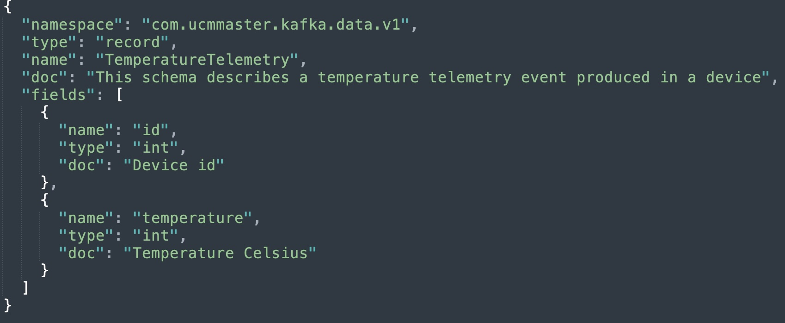
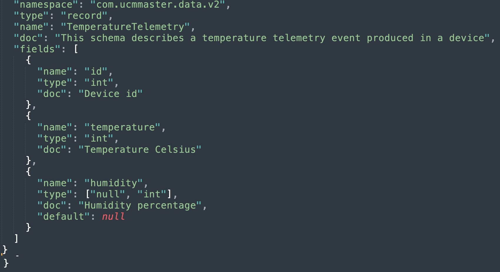

# Schema Registry

En este ejercicio vamos a explorar la funcionalidad que aporta Confluent Schema Registry

Primeramente exploraremos el API REST, y una vez entendamos cómo funcionan las diferentes llamadas a la API REST, haremos uso de un plugin Maven junto con algún ejemplo para ver la serialización en acción.

## REST API

[API REST](https://docs.confluent.io/platform/current/schema-registry/develop/api.html)

Tal y como venimos haciendo, utilizaremos los comandos `curl` y `jq` en una terminal.

### Registrar un schema

Los schemas Avro se definen en formato JSON. Podéis consultar la especificación [aquí](https://avro.apache.org/docs/current/specification/). 

En este paso vamos a registrar el siguiente schema:  



Algunos de los campos importantes del schema son:

- **namespace** : espacio de nombres que identifica unívocamente al tipo/clase. En el código generado para el lenguaje Java será el paquete
- **name** : nombre del tipo/clase. En el código generado para el lenguaje Java será la clase
- **fields** : lista de campos
- **doc**: documentación sobre el elemento en cuestión:
- **type**: tipo de datos. Avro admite tipos simples y tipos complejos

```bash
jq '. | {schema: tojson}' ./src/main/avro/com.ucmmaster.kafka.data.v1.TemperatureTelemetry.avsc | curl -s -X POST -H "Content-Type: application/vnd.schemaregistry.v1+json" http://localhost:8081/subjects/temperature-telemetry-value/versions  -d @- | jq 
 ```

Obtendremos una respuesta como esta:

```json
{
  "id": 1
}
```
La respuesta de la solicitud POST es el ID que Schema Registry asignó al nuevo esquema. 

Schema Registry asigna un ID único (un número que aumenta de forma monótona y secuencial) a cada esquema agregado. 

Los clientes almacenan este ID en en su caché local (de schemas).

Antes de continuar con otro endpoint, quiero destacar la parte de la URL relativa a subjects/temeperature-telemetry-value/, que especifica el nombre del **subject** (sujeto) para el esquema. 

Schema Registry usa el nombre del subject para gestionar el alcance de cualquier cambio/evolución realizado en un esquema.

En este caso, el subject es temperature-telemetry **-value**. Esto quiere decir que los valores de los mensajes producidos en el topic **temperature-telemetry** deben seguir dicha estructura. 

Los subjects tienen un papel relevante en la gestión de cambios admitidos.

### Listar subjects

```bash
curl -s "http://localhost:8081/subjects" | jq
```

Obtendremos una respuesta como esta:

```json
[
  "temperature-telemetry-value"
]
```

### Listar todas las versiones de un subject

```bash
curl -s "http://localhost:8081/subjects/temperature-telemetry-value/versions" | jq
```
Obtendremos una respuesta como esta:

```json
[
1
]
```

### Recuperar una versión concreta de un subject

```bash
curl -s "http://localhost:8081/subjects/temperature-telemetry-value/versions/1" | jq
```
Obtendremos una respuesta como esta:

```json
{
  "subject": "temperature-telemetry-value",
  "version": 1,
  "id": 1,
  "schema": "{\"type\":\"record\",\"name\":\"TemperatureTelemetry\",\"namespace\":\"com.ucmmaster.kafka.data.v1\",\"doc\":\"This schema describes a temperature telemetry event produced in a device\",\"fields\":[{\"name\":\"id\",\"type\":\"int\",\"doc\":\"Device id\"},{\"name\":\"temperature\",\"type\":\"int\",\"doc\":\"Temperature Celsius\"}]}"
}
```
El valor del campo **schema** está formateado como un string, por lo que las comillas están escapadas y se eliminan todos los caracteres de nueva línea.

### Recuperar la última versión de un subject

```bash
curl -s "http://localhost:8081/subjects/temperature-telemetry-value/versions/latest" | jq
```

```json
{
"subject": "temperature-telemetry-value",
"version": 1,
"id": 1,
"schema": "{\"type\":\"record\",\"name\":\"TemperatureTelemetry\",\"namespace\":\"com.ucmmaster.kafka.data.v1\",\"doc\":\"This schema describes a temperature telemetry event produced in a device\",\"fields\":[{\"name\":\"id\",\"type\":\"int\",\"doc\":\"Device id\"},{\"name\":\"temperature\",\"type\":\"int\",\"doc\":\"Temperature Celsius\"}]}"
}
```

### Modo de compatibilidad por defecto

```bash
curl -s "http://localhost:8081/config" | jq
```

```json
{
  "compatibilityLevel": "BACKWARD"
}

```

## MAVEN PLUGIN

Normalmente, se utilizan los plugins de herramientas de compilación (Maven/Gradle,SBT) para interactuar con Schema Registry.

Generar código a partir del esquema facilita la vida de los desarrolladores, ya que automatiza el proceso repetitivo de crear objetos de dominio. 

Además, al mantener los esquemas en un sistema de control de versiones (como Git), se reduce significativamente la posibilidad de errores, como definir un campo como string cuando debería ser long al crear los objetos de dominio.

Asimismo, cuando se realiza un cambio en un esquema, simplemente se comparte el cambio en el repositorio, y otros desarrolladores pueden actualizar su código, regenerar las clases y estar al día de manera rápida y eficiente.
 
[Maven Plugin](https://docs.confluent.io/platform/current/schema-registry/develop/maven-plugin.html)

### Comprobar compatibilidad

Vamos a comprobar la compatibilidad BACKWARD de la nueva version del schema



```bash
 mvn clean schema-registry:test-compatibility
```

```bash
[INFO] Scanning for projects...
[INFO] 
[INFO] -------------------< com.ucmmaster:schema-registry >--------------------
[INFO] Building schema-registry 1.0
[INFO]   from pom.xml
[INFO] --------------------------------[ jar ]---------------------------------
[INFO] 
[INFO] --- clean:3.2.0:clean (default-clean) @ schema-registry ---
[INFO] 
[INFO] --- schema-registry:7.8.0:test-compatibility (default-cli) @ schema-registry ---
[INFO] Schema /IdeaProjects/kafka-curso/7.schema_registry/src/main/avro/com.ucmmaster.kafka.data.v2.TemperatureTelemetry.avsc is compatible with subject(temperature-telemetry-value)
[INFO] ------------------------------------------------------------------------
[INFO] BUILD SUCCESS
[INFO] ------------------------------------------------------------------------
[INFO] Total time:  0.486 s
[INFO] ------------------------------------------------------------------------
```

### Registrar nueva version

Vamos a registrar la nueva versión

```bash
 mvn clean schema-registry:register
```

```bash
[INFO] Scanning for projects...
[INFO] 
[INFO] -------------------< com.ucmmaster:schema-registry >--------------------
[INFO] Building schema-registry 1.0
[INFO]   from pom.xml
[INFO] --------------------------------[ jar ]---------------------------------
[INFO] 
[INFO] --- clean:3.2.0:clean (default-clean) @ schema-registry ---
[INFO] 
[INFO] --- schema-registry:7.8.0:register (default-cli) @ schema-registry ---
[INFO] Registered subject(temperature-telemetry-value) with id 2 version 2
[INFO] ------------------------------------------------------------------------
[INFO] BUILD SUCCESS
[INFO] ------------------------------------------------------------------------
[INFO] Total time:  0.547 s
[INFO] ------------------------------------------------------------------------
```